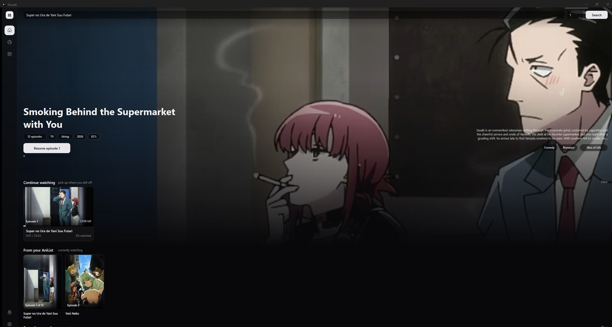
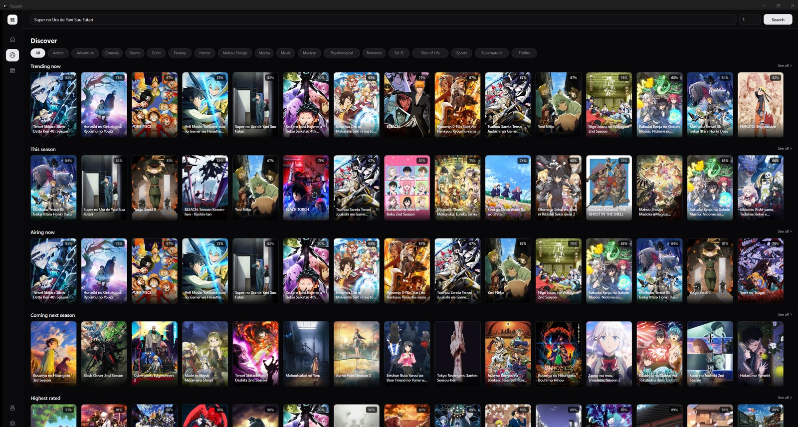
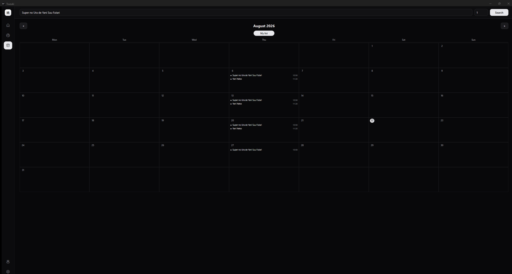
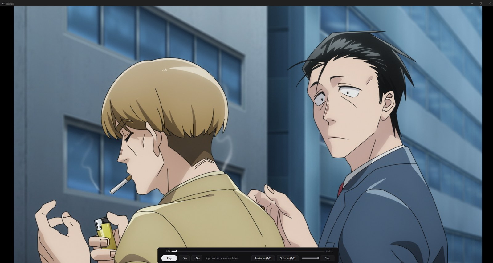
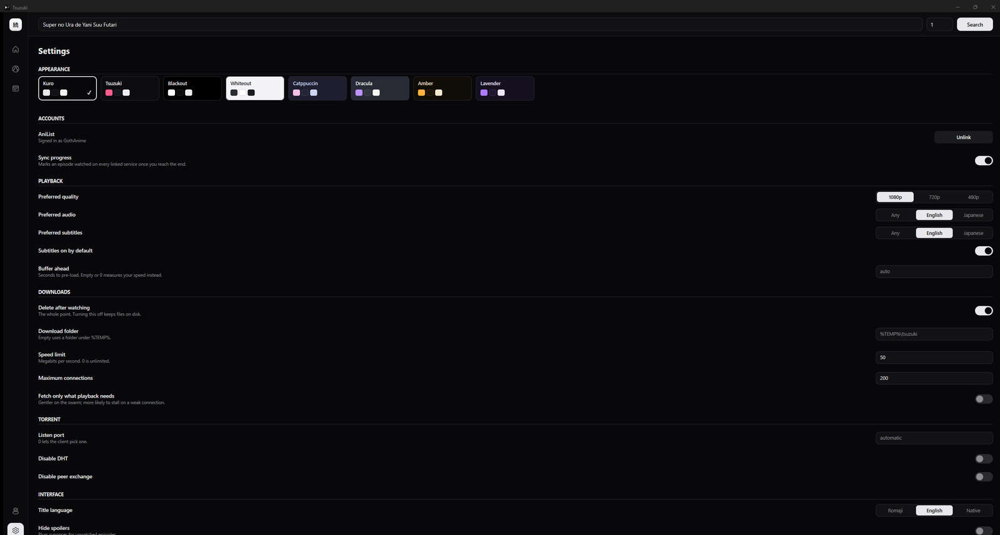

# Tsuzuki (続き)

Anime torrent streaming for Windows. Pick an episode, it plays while it
downloads, and your AniList stays up to date on its own.

<br clear="left">



Named for the card at the end of an episode. The project started because
another client kept playing the wrong continuation, so the one rule here is
that it never plays a file you did not ask for. If the episode you wanted is
not in the torrent, it says so instead of picking something else.

Written in C++. No Electron, no browser engine, no web view. The interface is
drawn directly with Direct2D.

## What it does

- **Search every source at once.** Nyaa, AnimeTosho, SubsPlease and SeaDex,
  merged and de-duplicated by infohash.
- **Pick the episode, not the release.** Results are grouped by episode. Ask
  for one that is not on the page and it goes and searches for it, because
  indexes return their most-seeded results first and the early episodes of an
  airing show fall off the end.
- **Play while downloading.** The episode is served to mpv over a local HTTP
  server, so a read of a part that has not arrived waits for it. mpv is
  embedded in the window, not launched beside it.
- **Track automatically.** Finishing an episode marks it watched on AniList.
  Resume points are per episode, so opening episode 8 does not forget where you
  were in episode 5.
- **Clean up.** Downloads are deleted after you finish watching, verified
  against the filesystem rather than assumed.

## Screens

Browse what is airing, what is trending, and what is on your list.

| | |
|---|---|
|  |  |

Playback controls are drawn in the window and driven over mpv's IPC socket, so
there are no keybindings to learn. Audio and subtitle tracks are chosen by
reading the tracks themselves, not by trusting a language tag, which is how a
signs-and-songs track stops being mistaken for full subtitles.



Eight themes. Kuro, the black and white one, is the default.



## Build

```
cmake --preset default
cmake --build build --config Release
```

Needs `VCPKG_ROOT` set. Dependencies come from `vcpkg.json`. MSVC, x64.

Run `Tsuzuki.exe` from `build\Release`. The DLLs need to sit beside it, so it
is portable as a folder rather than as a single file. Downloads go to
`%TEMP%\tsuzuki` unless you point them somewhere else in Settings.

There is also a console tool, if you want one:

```
tsuzuki-cli search "frieren" --episode 5     # find it and play it
tsuzuki-cli "magnet:?xt=urn:btih:..."        # list the files, pick one
tsuzuki-cli "magnet:?..." --episode 5 --keep # play it, keep the download
```

## Built with

libtorrent-rasterbar, mpv, Anitomy, Direct2D and DirectWrite, libcurl,
nlohmann-json, cpp-httplib, pugixml. CMake and vcpkg.

## Notes

[docs/NOTES.md](docs/NOTES.md) has the write-ups worth keeping: how the
adaptive buffer is sized, why AniList linking needs no client secret, and the
mpv IPC detail that silently breaks every playback control on Windows.

## Licence

libtorrent and mpv are GPL-family and Anitomy is permissive, which constrains
how binaries could be distributed.

Not affiliated with any other client, and deliberately not sharing anyone's
name or branding. Ships no sources, no indexes and no media.
